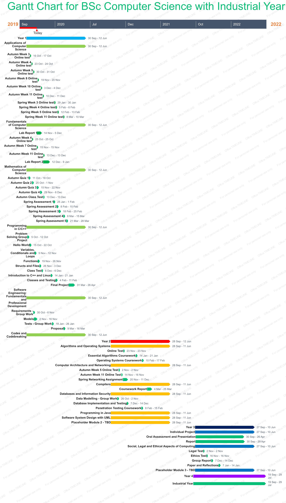

#### Module Code: CS1SE17
#### Title: *My Learning Plan*
#### Individual Learning Plan Report
#### Submitted By: Shavin Croos (27015244)
#### Date (when the work completed): 14th of November 2019.
#### Actual hrs spent for the assignment: 20 hours


#### Contents
````s
1.1 Introduction and Background ...............................................................1

   1.2 Abstract ...............................................................
   
2 Charts and Justifications .......................................................2
 
3. Reflection ...............................................................3

4. Appendix A - CV ..........................................................4

5. Bibliography .............................................................5
````

#### 1.1 Introduction and Background

For this task, the main objective is to describe about my university degree, which is BSc Computer Science with an Industrial Year, in terms of the coursework and assignments. This task will have to consider important factors such as time (e.g. days, months or years), modules and topics that this degree will have. For this task to be carried out, I will be creating 2 different charts to represent the data found on the program specifications as well as the module outlines. Extra information will be sourced and gathered from the University of Reading Blackboard in the software engineering module.

The first chart I’ll be making is called a work breakdown structure (WBS). This is a hierarchical breakdown of all the smaller components that make up a project. The WBS allows for a team’s work to be organised into manageable sections and shows the subdivision of the effort that will needed for the objective to be achieved. The WBS is first created by having an objective or a goal that you want to achieve. Then the objective is then subdivided into smaller, manageable tasks in terms of the size, time needed and responsibility. The manageable tasks are interchangeably known as sub-tasks or the 2nd and 3rd nodes. The benefit of the WBS is that it can be used to spot potential scope risks if a subdivided task has not been well defined. In addition to this, WBS allows for the rapid build up of a schedule by designating effort estimates to specific sections of the WBS. Furthermore, WBS can help identify communication points as well as providing a visual of impacts when the progress of the subtasks is falling short. Moreover, it provides a proven and repeatable approach to planning projects. WBS is also great for ensuring that no important subtasks are forgotten, and it provides a tool for the team to brainstorm some ideas and discuss their ideas with their colleagues. On the other hand, the WBS uses a step-by-step approach to complete an objective. This could be unattractive to some team members as this approach can lead to micromanagement, which is where the manager closely observes the work that is going on and reminds their colleagues about their work. As a result, the team members may get a feel of a lack of freedom within their work environment. WBS can become outdated quickly and very easily since the schedule will always have to constantly adapt to new changes within the work environment in order to achieve the objective. Another point is that if a WBS is created by the manager without much input from other colleagues of the project, the team members may give in little contribution to no support at all from the WBS. What is more is that whilst the WBS may give manageable chunks of work to be completed at once in a few hours, the workers end up spend more time on smaller tasks while the manager has to keep track of all of the subtasks, which is a mess and will produce very poor results. For my WBS, the main objective will be obtaining the degree: BSc Computer Science with an Industrial Year. After this, the second tier containing the second nodes will represent the years of the degree programme (e.g. year 1, year 2 etc.). The third tier will represent the modules required to complete the degree programme and the child nodes of the third tier will show the topics to be completed in these modules. This will include all the assignments, coursework and exams.

The second chart to be created is called a Gantt chart. Also known as a harmonogram, the Gantt chart is a form of bar chart that creates a picture of a project schedule. The tasks to be completed are listed along the vertical axis and time intervals are listed along the horizontal axis. The width of the bars determines the time needed to complete said activity. Gantt charts are created with an early start time approach, where the tasks are scheduled to start as soon as the conditions for tasks have been met. Unlike WBS, the tasks in a Gantt chart can be seen in the format of days, weeks, months and years, which allows for the clear visibilities of date and time frames. Furthermore, the Gantt chart can visually show the progress of each task and thus helps in efficient time management of the project. This allows for effective team management and coordination. The Gantt chart is good tool to present to your group in Team Meetings so that any new ideas could be suggested by the team members to help reach the objective quicker. The Gantt chart is more effectively read and understood by anyone in the group than a WBS is.  In addition to this, Gantt charts allow for better resource allocation, which will help the team members to finish the smaller tasks more quickly and effectively. Although the Gantt chart has its benefits, there are some down sides to using this type of chart. Firstly, a Gantt chart requires time and effort to be created and managed since there could be new tasks that need to be added along the way.  Moreover, if the project is big in terms of the number of tasks that need to be completed, then scrolling through the chart will become tedious to do. It tends to be very difficult to realign the tasks from one section of the Gantt chart to another.  Also, not all the tasks are visible in a single view of the Gantt chart, which means it could be difficult to see which sub-tasks have been completed and which ones are yet to be completed. These stacks of bars only show the time required to complete a sub-task and not the number of hours you can work each day on these sub-tasks. On top of this, the bigger the project, the complex the Gantt chart can become, which could make it not ideal in small enterprises or companies. For my Gantt chart, I have included the years of study, modules, topics and all the assignments, coursework and exams on my vertical axis and created time intervals between 2019 and 2022 on the horizontal axis.

#### 1.2 Abstract

A WBS displays the objective and the sub-tasks in a hierarchal manner to see which parts of the work need to be done. The WBS does not show the flow of time. The Gantt chart shows the sub-tasks in the form of a horizontal bar graph that shows the time needed to complete every task on the chart. The WBS is very good for spotting incomplete parts of the work tree. It also can be used as a template for creating more work management plans for other projects like the one being done. However, the WBS is not work environment friendly as it may cause tensions between the manager of the group and the teammates through micromanagement. The Gantt is very easy to visualise and use without problem. The progress of each sub-task can be seen easily by the manager of the group. Time can be represented better on the Gantt chart than it can on a WBS diagram. However, the Gantt chart takes a long time to develop and manage. Also, with a bigger project, not all the tasks listed will be easily seen and so some of the tasks’ progress may not be recognised as well as it could have been.  

#### 2 Charts and Justifications

#### WBS for BSc Computer Science with Industrial Year

.vpd.png)




For the WBS, I used a software called Visual Paradigm as that software allowed for the automatic formatting of the nodes of the WBS and the space to create the WBS in. I initially used the software called Planhammer to create my WBS, but I found that this software was very difficult to use and was not user-friendly at all.
I used a software called Office Timeline to create my Gantt Chart as it was quite easy to use and you could set the beginning date at any point in time, even after the start date had been passed. Like before, I had used Planhammer to create my WBS, but the software did not allow me to go to the original start date for the degree I was doing and it only allowed me to start on the current day.

#### 3 Reflection

What this task has taught me is that there are many ways to organise your work depending on your needs and the extra activities you do outside of work. This has helped me to reinforce the idea about the work-life balance. Furthermore, this task has shown insight as to how software development teams work and how they organise themselves so that the tasks are done to the time limit. It goes to show that work at university has to be more well-managed than at school, meaning you need to find the information you want to know about to help complete certain tasks.
The task also shows that not everything is as it seems as even creating something simple as WBS and Gantt graphs requires time and effort to be able to do. In addition to this, these things are not static and so would be tedious to do constantly. Moreover, this task teaches you why certain people skills such as teamwork and communication skills are really vital in the work environment. Without those skills, the tasks and jobs would not be completed to the standard expected by the company as a whole. The task also proves that the unexpected can happen at any time and at anyplace. For example, a software could suddenly crash when you least expect it and it would be up to you to come up with a solution quickly as possible. The task tells us if one part works together well with the others, then the outcome will be rewarding. If this doesn’t happen, it could put the entire project at risk and the other teammates at risk at stalling because of a part falling short.

#### 4 Appendix A - CV


#### 5 Bibliography

https://content.wisestep.com/work-breakdown-structure-advantages-disadvantages/

https://analysistabs.com/gantt-chart/advantages-disadvantages/

https://project-management.com/advantages-and-disadvantages-of-gantt-charts/

https://standout-cv.com/pages/software-developer-cv-example

https://www.livecareer.co.uk/templates/cv/engineering/software-engineer-template

https://www.monster.co.uk/career-advice/article/software-developer-cv-example